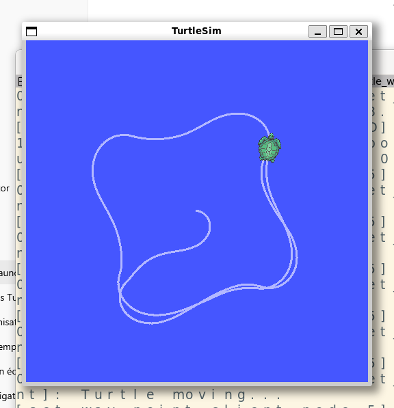
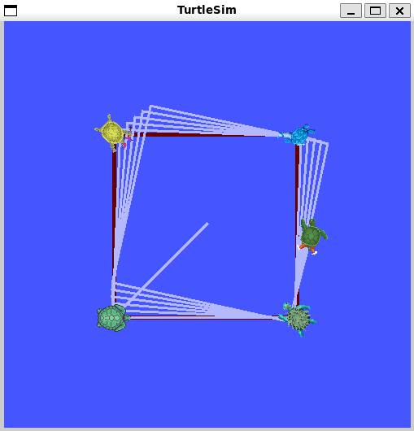
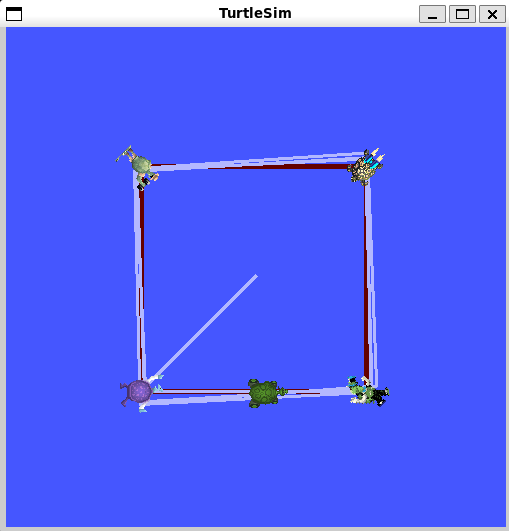
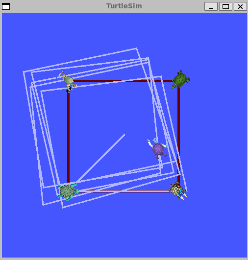
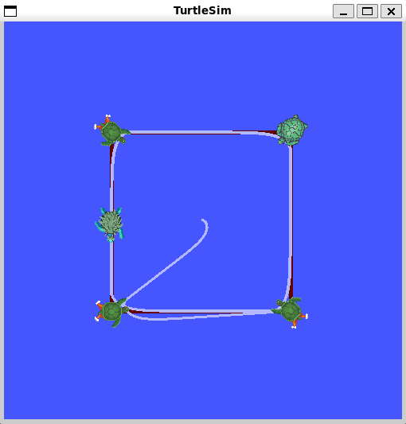
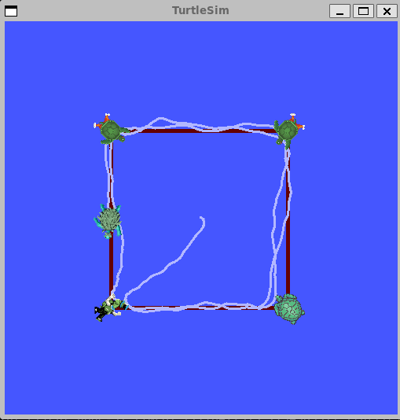
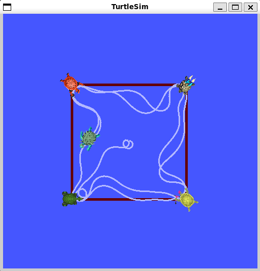
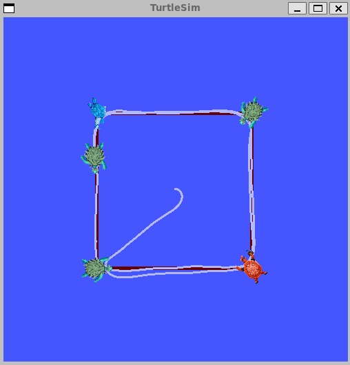

# turtle_bringup


Package ROS 2 (Jazzy) de régulation de la tortue TurtleSim. Il implémente une chaîne complète **bruit → filtrage → régulation** : une pose bruitée est publiée, filtrée par un filtre passe-bas, puis un nœud de régulation guide la tortue vers un waypoint.

---

## Architecture des nœuds

```
turtlesim_node
      │  /turtle1/pose (Pose brute)
      ▼
noisy_pose_publisher_node  ──►  /turtle1/pose_noisy
                                         │
                              filtered_pose_publisher_node
                                         │
                                /turtle1/pose_filtered
                                         │
                              set_way_point_node
                                         │
                              /turtle1/cmd_vel ──► turtlesim_node
```

---

## Nœuds

### `turtlesim_node` *(pkg: turtlesim)*
Simulateur de tortue standard de ROS 2.

---

### `filtered_pose_publisher_node`
Filtre passe-bas exponentiel appliqué sur la pose de la tortue.

| Paramètre | Type | Défaut | Description |
|-----------|------|--------|-------------|
| `alpha` | `double` | `0.1` | Coefficient du filtre (0 = très lissé, 1 = pas de filtrage) |

---

### `noisy_pose_publisher_node`
Ajoute un bruit uniforme à la pose publiée par TurtleSim, pour simuler des mesures imparfaites.

| Paramètre | Type | Défaut | Description |
|-----------|------|--------|-------------|
| `noise_min` | `double` | `-0.5` | Borne inférieure du bruit ajouté |
| `noise_max` | `double` | `0.5` | Borne supérieure du bruit ajouté |

---

### `set_way_point_node`
Régulateur proportionnel qui dirige la tortue vers un waypoint cible. Utilise la pose **filtrée** via un remap.

| Paramètre | Type | Défaut | Description |
|-----------|------|--------|-------------|
| `Kpl` | `double` | `1.5` | Gain proportionnel sur la vitesse linéaire |
| `Kp` | `double` | `20.0` | Gain proportionnel sur la vitesse angulaire |

> **Remap :** `/turtle1/pose` → `/turtle1/pose_filtered`

---

# Prérequis

- ROS 2 **Jazzy Jalisco**
- Package `turtlesim` installé :
  ```bash
  sudo apt install ros-jazzy-turtlesim
  ```

---

# Installation

```bash
# Cloner le dépôt dans votre workspace
cd ~/ros2_ws/src
git clone https://github.com/Kramoth/turtle_bringup.git

# Compiler
cd ~/ros2_ws
colcon build --packages-select turtle_bringup

# Sourcer
source install/setup.bash
```

---

# Lancement

## Dead reckoning
```bash
ros2 launch turtle_bringup turtle_regulation_no_noise.launch.xml
```
On observe le comportement suivant:

<!--  -->
<p align="center">
  <br>
  <em>Figure 1 – Résultat de la régulation sous turtlesim</em>
</p>

La tortue décrit un carré mais drift dans le temps sans moyen de corriger sa position

## On remplace l'estimation de la tortue par la position de la tortue

```bash
ros2 launch turtle_bringup turtle_closeloop.launch.xml 
```
On observe le comportement suivant:

<!--  -->
<p align="center">
  <br>
  <em>Figure 1 – Résultat de la régulation sous turtlesim</em>
</p>

## On ajoute du bruit dans la position

```bash
ros2 launch turtle_bringup turtle_closeloop_noise.launch.xml 
```
On observe le comportement suivant:

<!--  -->
<p align="center">
  <br>
  <em>Figure 1 – Résultat de la régulation sous turtlesim</em>
</p>
La tortue ne suit plus du tout les way points

---

## Regulateur proportionnel
### Sans bruit dans un monde parfait KP=30 KPL=1.5

```bash
ros2 launch turtle_bringup turtle_regulation_no_noise.launch.xml
```
On observe le comportement suivant:

<!--  -->
<p align="center">
  <br>
  <em>Figure 1 – Résultat de la régulation sous turtlesim</em>
</p>

La tortue décrit un carré et se déplace rapidement.

### On ajoute du bruit KP=30 KPL=1.5

```bash
ros2 launch turtle_bringup turtle_regulation_noise.launch.xml
```
On observe le comportement suivant:
<!--  -->
<p align="center">
  <br>
  <em>Figure 1 – Résultat de la régulation sous turtlesim</em>
</p>

La tortue décrit difficilement le carré.

### On filtre le bruit KP=30 KPL=1.5

```bash
ros2 launch turtle_bringup turtle_regulation_bringup.launch.xml
```
On observe le comportement suivant:

<!--  -->
<p align="center">
  <br>
  <em>Figure 1 – Résultat de la régulation sous turtlesim</em>
</p>

La tortue parvient a joindre les way points mais elle ne suit plus un carré
### On ajuste les gain KP=6.0 KPL=0.4

```bash
ros2 launch turtle_bringup turtle_regulation_bringup.launch.xml kp:=6.0 kpl:=0.4
```
On observe le comportement suivant:

<!--  -->
<p align="center">
  <br>
  <em>Figure 1 – Résultat de la régulation sous turtlesim</em>
</p>

La tortue décrit un carré et se déplace lentement.

---

## Topics

| Topic | Type | Description |
|-------|------|-------------|
| `/turtle1/pose` | `turtlesim/msg/Pose` | Pose brute publiée par TurtleSim |
| `/turtle1/pose_noisy` | `turtlesim/msg/Pose` | Pose avec bruit ajouté |
| `/turtle1/pose_filtered` | `turtlesim/msg/Pose` | Pose filtrée (filtre passe-bas) |
| `/turtle1/cmd_vel` | `geometry_msgs/msg/Twist` | Commande en vitesse envoyée à la tortue |
